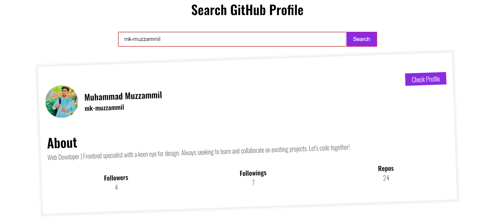

# GitHub-Profile_viewer-App-Using-HTML-CSS-and-Js
I will take figma design of this project and Made this project for practising my HTML CSS skills feel free to see and practise it by your own I have made this by two different solutions one is commented for your guidance and one is running 
# GitHub Profile Search App(ApI Usage)

GitHub Profile Search App is a web application that allows users to search for GitHub profiles by entering their username. It fetches and displays relevant profile information, including the user's avatar, name, bio, number of followers, following, and public repositories.

## Getting Started

To use the GitHub Profile Search App, follow these steps:

1. Clone or download the repository to your local machine.
2. Open the `index.html` file in your web browser.
3. Enter a GitHub username in the provided input field and click the "Search" button.
4. The app will fetch and display the GitHub profile information for the entered username.

## Features

- Simple and user-friendly interface.
- Real-time profile data retrieval from the GitHub API.
- Displays the user's avatar, name, bio, followers, following, and public repositories.
- Responsive design for various screen sizes.

## Technologies Used

The GitHub Profile Search App is built using the following technologies:

- HTML
- CSS
- JavaScript
- [GitHub REST API](https://docs.github.com/en/rest)

## Contributing

Contributions to this project are welcome! If you find any issues or want to suggest improvements, please open a pull request. Your contributions will be appreciated.

## License

This project is licensed under the [MIT License](LICENSE).

## Acknowledgments

- This project was inspired by the idea of creating a simple GitHub profile search application.
- Thanks to GitHub for providing the [GitHub REST API](https://docs.github.com/en/rest) that allows us to fetch user data.

## Contact

If you have any questions or suggestions regarding this project, you can reach out to the project owner:

- Name: [Muhammad Muzzammil]
- Email: [muzzammil759@gmail.com]

Happy coding!

### #GitHubProfileSearch #WebApp #JavaScript #HTML #CSS #GitHubAPI #OpenSource #GitHub
